# Sapphire-Lands-Real-Estates

We have Created the website by using: 
1. 'React' in Frontend
2. 'HTML', 'CSS', and 'JAVASCRIPT' in backend
Deployed Link for the Frontend of the Website:  https://sapphire-lands-2svx26qoh-survi09mukherjees-projects.vercel.app

Home Page...
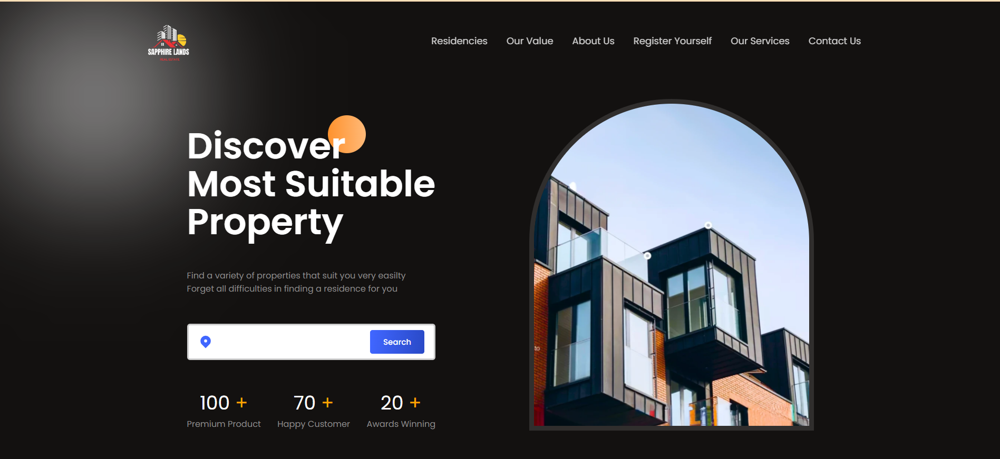

Summary of Properties...
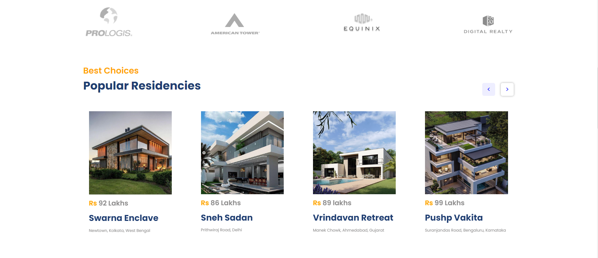

Our Value...
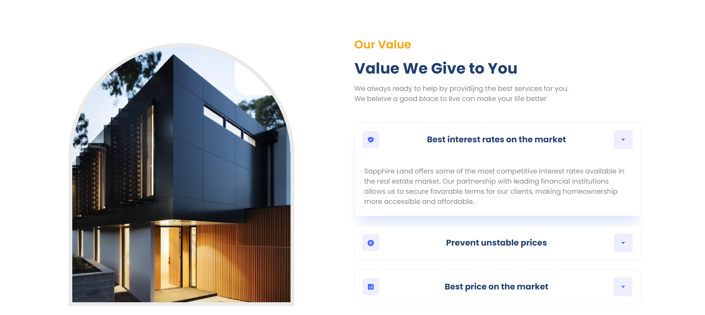

Getting Started...
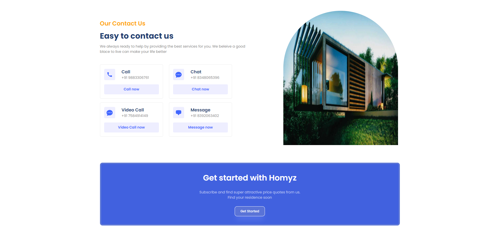

Footer Page...
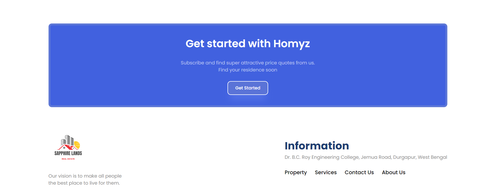

Properties to Buy...
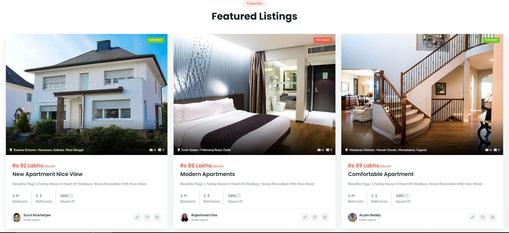
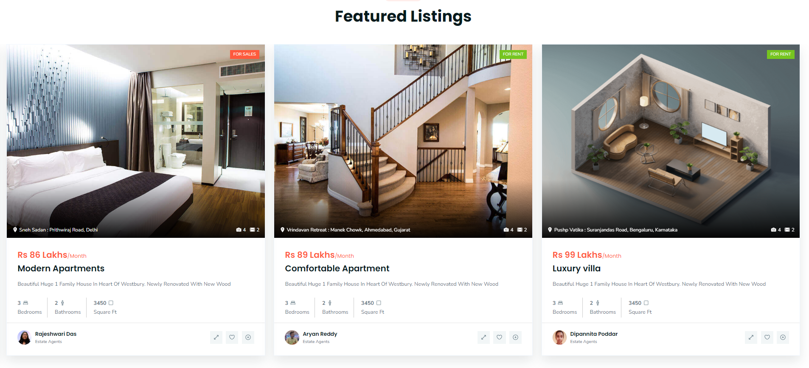

About Us...
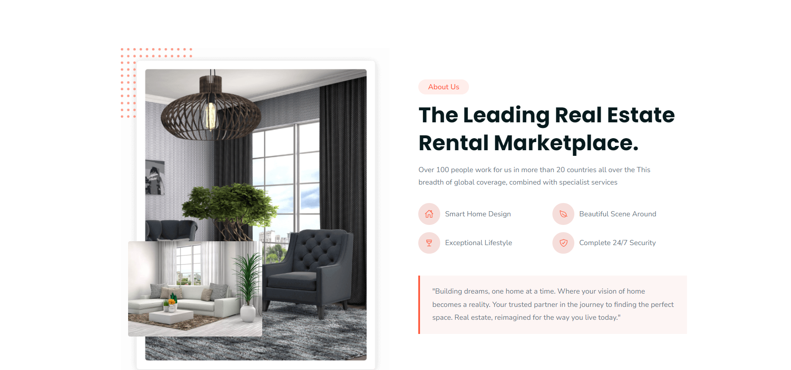

Register Page...
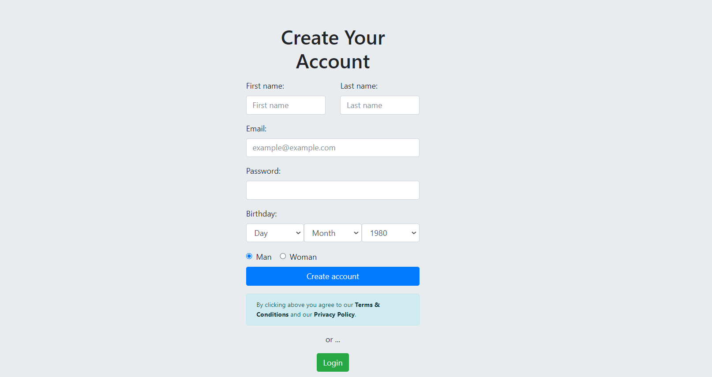

Login Page...
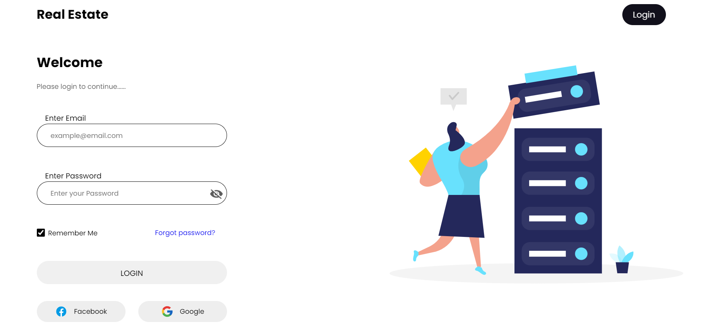

Our Services Provided...
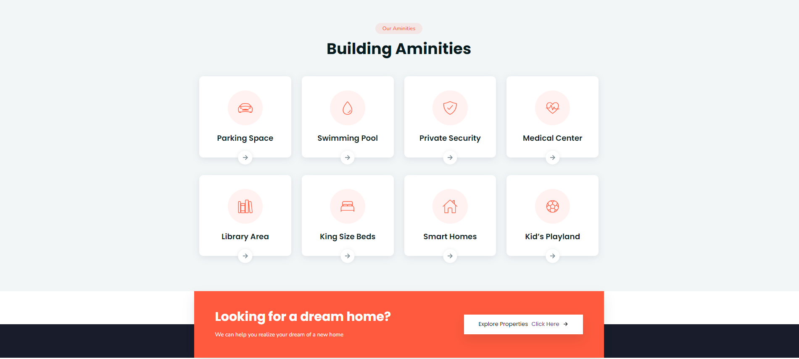

Contact Us...
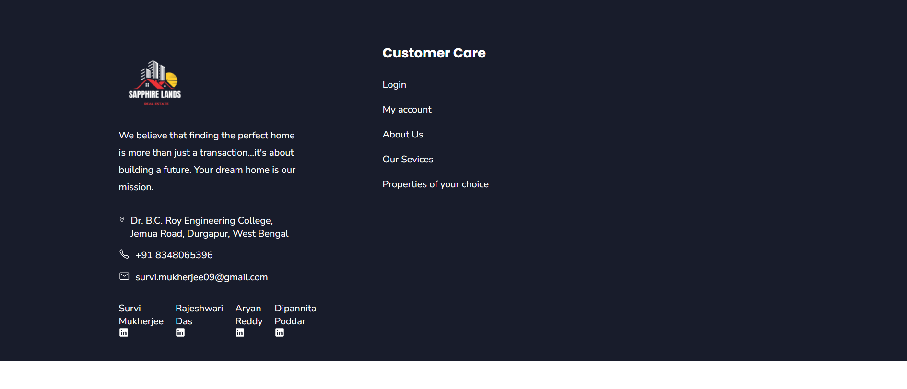
